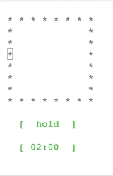

# breath

Breathing practices

### Technologies

- PHP
- Symfony
- Symfony/Console

### Installation

1. Clone this repo
2. Run `composer install`

## Usage Options

```
Console Tool

Usage:
  command [options] [arguments]

Options:
  -h, --help            Display help for the given command. When no command is given display help for the list command
  -q, --quiet           Do not output any message
  -V, --version         Display this application version
      --ansi|--no-ansi  Force (or disable --no-ansi) ANSI output
  -n, --no-interaction  Do not ask any interactive question
  -v|vv|vvv, --verbose  Increase the verbosity of messages: 1 for normal output, 2 for more verbose output and 3 for debug

Available commands:
  completion          Dump the shell completion script
  help                Display help for a command
  list                List commands
 breath
  breath:description  Get breathing practice description
  breath:instruction  Get breathing practice instruction
  breath:practice     Start breathing practice

```

### Practice

```shell
./bin/console breath:practice
```

```
 * * * * * * * *
               *
               *
               *
               *
 *             *
 *             *
 * * * * * * * *

   [  hold  ]

   [ 04:48  ]

```



### Instruction

```shell
./bin/console breath:instruction
```

Output

```
1. Inhale for a count of four
2. Hold your breath for a count of four
3. Exhale for a count of four
4. Hold your breath for a count of four
5. Start the cycle again and breathe this way for 5 minutes
```

### Description

```shell
./bin/console breath:description
```

Output

```
This technique is used by the U.S. Navy Seals to quickly regain control in a stressful situation.
Imagine a box or square with equal sides. Each side of your square is one breath cycle: inhale, breath hold, exhale, breath hold. Like the sides of a square, the cycles are equal: each lasts for 4 counts or seconds.
When you breathe, imagine moving along the sides of this square. According to clinical psychologist Scott Symington, such visualization helps to focus on the breath and adapt to the necessary rhythm more quickly.
```